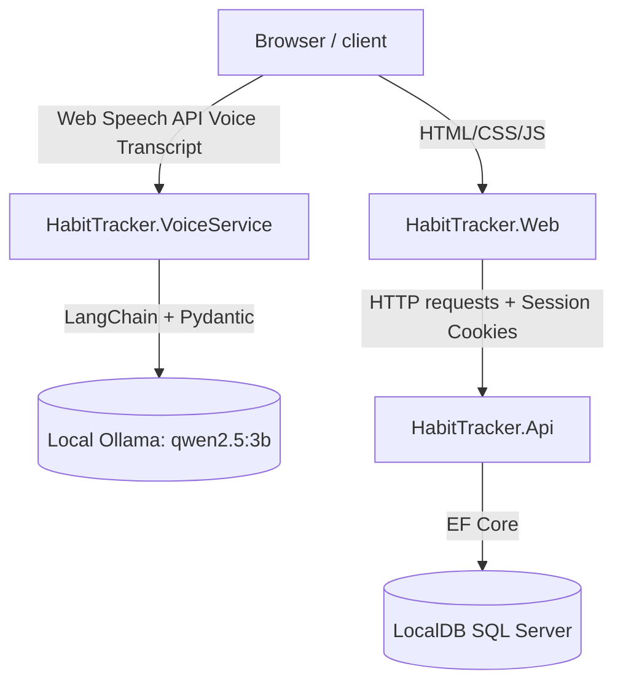

# HabitTracker

A full-stack habit tracking and routine management system featuring a decoupled .NET backend API, a Razor Pages frontend, and a Python-based LLM voice-extraction microservice.

---

## Architecture Overview

HabitTracker is built with a modern, decoupled architecture split into three distinct services:

1. **`HabitTracker.Api` (Backend)**: An ASP.NET Core Web API project (.NET 10) exposing Entity Framework Core business logic, SQL database access, and ASP.NET Core Identity services via REST endpoints.
2. **`HabitTracker.Web` (Frontend)**: An ASP.NET Core Razor Pages application (.NET 10) that consumes the API over HTTP using a typed `HttpClient` with automatic session cookie forwarding and local Data Protection decryption.
3. **`HabitTracker.VoiceService` (Voice extraction)**: A Python FastAPI microservice that extracts structured habit details (Title, Description, Frequency, Start Date, End Date) from raw voice transcripts using LangChain and a local Ollama LLM (`qwen2.5:3b`).



---

## Project Structure

```text
HabitTracker/
├── HabitTracker.slnx             # Modern Visual Studio Solution file
│
├── HabitTracker.Api/             # .NET 10 Web API Backend
│   ├── Controllers/              # API endpoints (Habits, Calendar, Kanban, Admin)
│   ├── Data/                     # ApplicationDbContext and database initializers/seeds
│   ├── Models/                   # Shared database schemas (Habit, HabitLog, ApplicationUser)
│   ├── Services/                 # Business logic and habit scheduling service
│   └── Properties/               # launchSettings (Dev port: 7234)
│
├── HabitTracker.Web/             # .NET 10 Razor Pages Frontend
│   ├── Pages/                    # UI Views (Habits list, Calendar, Kanban, Identity)
│   ├── Services/                 # typed HTTP client handlers for communication with API
│   ├── ViewModels/               # ViewModels mapping frontend representations
│   └── wwwroot/                  # Client-side assets (custom CSS & site logic)
│
└── HabitTracker.VoiceService/    # Python LLM Voice Parsing Service
    ├── main.py                   # FastAPI application and LangChain model binding
    ├── requirements.txt          # Python package requirements (FastAPI, LangChain, etc.)
    └── README.md                 # Dev setup guide for Python venv and Ollama
```

---

## Features

### 🔐 Security & Role-Based access
* **Shared Authentication Cookies**: Uses `.HabitTracker.Auth` cookie. Both the Api and Web applications are configured with a shared Data Protection key ring stored in `%LOCALAPPDATA%\HabitTrackerKeys` so the API can seamlessly decrypt and authenticate the cookie forwarded by the frontend.
* **Roles**: Supporting `Admin` and `User` roles. Admins manage user accounts (activations/deactivations) on `/AdminUsers`, while users manage their own habits, calendar, and kanban board.

### 📅 Calendar & Kanban Views
* **Interactive Kanban Board**: Habits are grouped into `Todo`, `InProgress`, and `Done` states. State changes are synchronized in real-time.
* **Monthly Calendar Grid**: Day cards display planned habits, partial executions, completions, and skips.

### 🎙️ AI Voice Form Filling
* **Mic Input**: The **Create Habit** page uses the browser's native **Web Speech API** to capture voice transcripts directly.
* **Ollama Integration**: Transcripts are processed by local Ollama (`qwen2.5:3b`) via `langchain-ollama`'s structured output. It extracts:
  * Habit Title & Detailed Description.
  * Habit Frequency (Daily, Weekly, Monthly) converted to correct database enum integers.
  * Start and End Dates (resolves relative terms like "starting tomorrow" or "for 30 days" relative to today's date).
* **Fallback Date Rules**: If the LLM does not extract a specific end date or duration, the service defaults the end date to exactly **21 days out** from the current date.

---

## Getting Started

### Prerequisites

* **.NET 10 SDK** (Visual Studio 2022 recommended)
* **SQL Server LocalDB** (installed by default with Visual Studio)
* **Python 3.8+**
* **Ollama** installed locally and running on port `11434` with the pulled model:
  ```bash
  ollama pull qwen2.5:3b
  ```

---

## Running the Project

### Step 1: Run the backend API & Web frontend (.NET)

#### 1. Setup User Secrets for Admin Credentials
Right-click on **`HabitTracker.Api`** in Visual Studio Solutions explorer, select **Manage User Secrets**, and paste the following config:
```json
{
  "AdminSeed": {
    "Email": "adityapradhan5060@gmail.com",
    "Password": "abc123ABC!"
  }
}
```

#### 2. Run EF Core Migrations
Open **Package Manager Console** (`Tools` -> `NuGet Package Manager` -> `Package Manager Console`), ensure **Default project** is set to **`HabitTracker.Api`**, and run:
```powershell
Update-Database
```

#### 3. Start Both Projects
1. Right-click the solution file -> select **Properties**.
2. Under **Startup Project**, select **Multiple startup projects**.
3. Set both **`HabitTracker.Api`** and **`HabitTracker.Web`** to **Start**.
4. Press **F5** to start debugging.
   * `HabitTracker.Web` will launch at `https://localhost:7123/`
   * `HabitTracker.Api` runs in background at `https://localhost:7234/`

---

### Step 2: Run the Voice Service (Python)

1. Open your terminal in the `HabitTracker.VoiceService` directory:
   ```bash
   cd HabitTracker.VoiceService
   ```
2. Create and activate a Python virtual environment:
   * **Windows (cmd):**
     ```cmd
     python -m venv .venv
     .venv\Scripts\activate.bat
     ```
   * **Windows (PowerShell):**
     ```powershell
     python -m venv .venv
     .venv\Scripts\activate.ps1
     ```
3. Install required packages:
   ```bash
   pip install -r requirements.txt
   ```
4. Run the FastAPI dev server:
   ```bash
   uvicorn main:app --reload --port 8000
   ```
   * FastAPI service will listen at `http://localhost:8000/`.
   * You can test the endpoints manually using the interactive docs at `http://localhost:8000/docs`.
